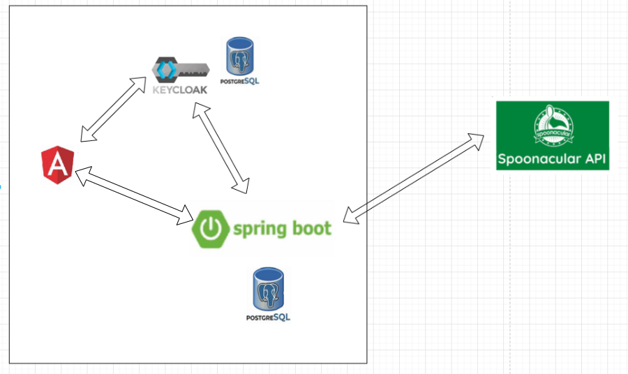
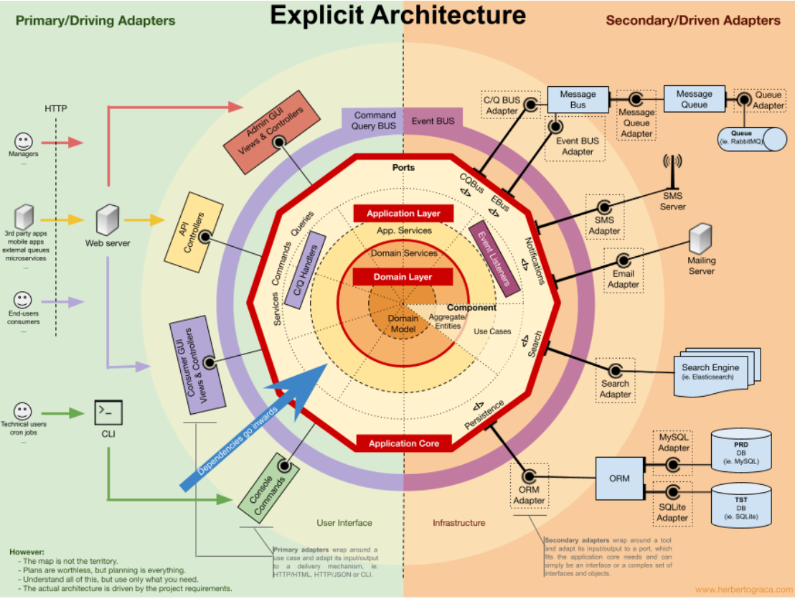

# Fridge Tracker

Fridge Tracker is application for managing fridge contents and generating recipes based on available items.

## Getting Started

### Clone the repository

````
git clone [repo URL]
````

### Run the application

Make sure **Docker** is installed.

1. **Build and start everything**

````
docker compose up --build
````

2. **Access the application**

Service - URL

Frontend (Angular) - http://localhost:4200

Backend (Spring Boot) - http://localhost:8081

Keycloak Admin Console - http://localhost:8080

## Features

**User registration and login**

**Create, list, sort, filter, and delete fridges**

**Add, delete, take, list, sort, filter items from fridges**

**👨‍🍳Get recipes based on available ingredients**

## System Architecture

### High level overview



### Angular Frontend

Technology: Angular 20

**Role in the System**

The frontend provides the complete user interface of the application. It renders views, gathers user input, and
orchestrates all user interactions. Authentication is handled via Keycloak using the OpenID Connect Authorization Code
Flow. After successful authentication, the frontend receives a JWT access token which it attaches to every request
directed to the backend.

**Key Responsibilities**

- Rendering UI components and managing client-side navigation
- Redirecting users to Keycloak for login/logout
- Storing and forwarding JWT tokens in API requests
- Consuming backend REST endpoints for fridge, item, and recipe operations

### Spring Boot Backend

Technology: Spring Boot 4.0.0, Java 25

**Role in the System**

Executes business use-cases, enforces domain rules, manages persistence, and integrates with external services such as
Spoonacular.

**Architectural Approach**

The backend follows the **“Explicit Architecture”** style inspired by DDD, Hexagonal Architecture, and CQRS, based on Herberto Graça’s work
(https://herbertograca.com/2017/11/16/explicit-architecture-01-ddd-hexagonal-onion-clean-cqrs-how-i-put-it-all-together/).
This approach was selected because it enforces a strict separation of concerns and keeps the domain model pure and independent of infrastructure.
Business logic resides at the core of the system, while external concerns—persistence, messaging, security, integrations—are implemented through ports and adapters.

This results in a system that is:
- Easier to maintain
- Easier to extend
- Conceptually clean and predictable



The codebase is covered with unit tests ensuring correctness of domain logic.
Architecture tests enforce module boundaries and prevent accidental coupling.
The REST API is described with OpenAPI, ensuring clear contracts, documentation, and the possibility to generate client SDKs.
Database migrations are managed using Flyway.

### Keycloak (Identity and Access Management)

Technology: Keycloak 26.1.0

Keycloak (https://www.keycloak.org/) acts as the system’s dedicated IAM provider. It manages user accounts, credentials,
sessions, and roles (currently we don't have multiple roles in the system).
It issues signed JWT tokens that the backend verifies for every request.

### Application Database ###

Technology: PostgreSQL

Persistent storage for application domain entities

### Keycloak database ###

Technology: PostgreSQL

This database is dedicated solely to Keycloak. It persists all IAM-related configuration and runtime state such as
users, executed flows, and client sessions.

### Spoonacular API (External Recipe Provider) ###

Technology: Third-party REST API

**Role in the System**

Spoonacular provides recipe recommendations based on ingredients present in the user's fridge. The backend is the only
component that communicates with Spoonacular, ensuring API keys remain secure and external dependencies are abstracted
away from the UI.

**Key Responsibilities**

- Accepting ingredient lists and returning recipe suggestions
- Providing structured data on used and missing ingredients

### End-to-End Flow Summary ###

**Authentication Flow**

- User accesses Angular application
- Angular redirects to Keycloak for authentication
- Keycloak validates credentials and issues tokens
- User is redirected back to Angular with OAuth2 code → exchanged for tokens

**Application Flow**

- Angular sends REST requests with Authorization: Bearer <token>
- Backend validates token
- Backend executes business logic and interacts with its database
- Backend fetches external recipes from Spoonacular when requested
- Backend returns the response to the frontend

## Improvements & Future Work ##

- Add **integration tests** using **Testcontainers** to run PostgreSQL and Keycloak in isolated test environments for realistic test behavior.
- Add statistics and history views based on the **fridge_item_event table**, where all item actions are recorded.
- Implement **notification system** (e.g., notify user when an item is about to expire).
- Add **edit functionality** for fridges and fridge items.